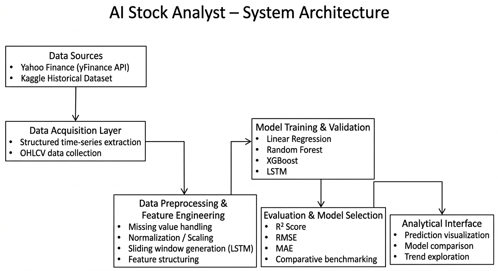
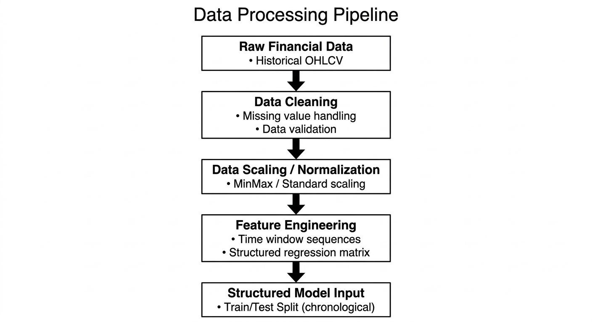
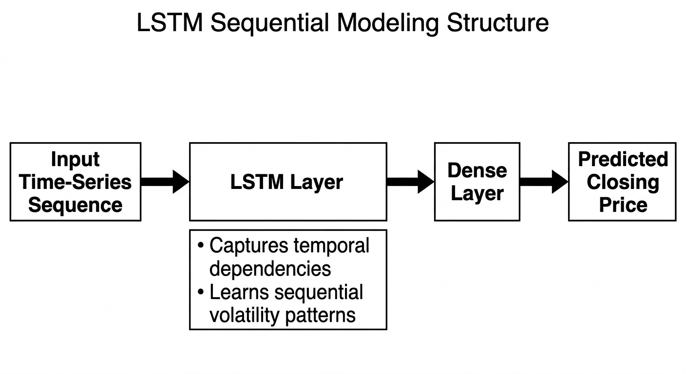

# Model Architecture Documentation  
AI Stock Analyst – Multi-Model Forecasting Framework  

---

## 1. Architectural Overview

The AI Stock Analyst platform follows a modular machine learning pipeline architecture designed to ensure reproducibility, structured experimentation, and fair comparative evaluation across multiple forecasting models.

The system is divided into five logical layers:

1. Data Acquisition  
2. Data Processing & Feature Engineering  
3. Model Training  
4. Evaluation & Model Comparison  
5. Analytical Interface Integration  

---

## 2. System Architecture Diagram

The architecture ensures separation between data handling, model logic, and presentation components to maintain modularity and maintainability.

---

## 3. Data Acquisition Layer

Financial time-series data is collected from:

- Yahoo Finance (via yFinance API)
- Kaggle historical stock datasets

The extracted dataset includes:

- Open, High, Low, Close prices  
- Volume  
- Time-indexed records  

All raw data is structured before entering the preprocessing pipeline.

---

## 4. Data Processing & Feature Engineering

The preprocessing framework ensures data integrity and stability through:

- Missing value handling  
- Chronological consistency checks  
- Data normalization / scaling  
- Feature structuring for regression models  
- Sliding window sequence generation for LSTM  

Time-series splitting respects chronological order to prevent data leakage.

---

## 5. Model Training Framework

The system integrates multiple model paradigms to capture diverse learning behaviors:

### Linear Regression
Statistical baseline capturing linear relationships between features and price movement.

### Random Forest Regressor
Ensemble-based tree model reducing variance and capturing non-linear interactions.

### XGBoost Regressor
Gradient boosting model optimized for structured financial data with strong generalization.

### LSTM (Long Short-Term Memory Network)
Sequential deep learning model designed to capture temporal dependencies in time-series data.

All models are trained under consistent preprocessing conditions to ensure fair performance comparison.

---

## 6. LSTM Sequential Modeling Structure

The LSTM architecture processes structured time windows to model short-term temporal dependencies and sequential volatility trends in stock prices.

---

## 7. Model Evaluation Strategy

Model performance is evaluated using:

- R² Score  
- Root Mean Squared Error (RMSE)  
- Mean Absolute Error (MAE)  

Evaluation ensures:

- Uniform train-test splits  
- Consistent scaling procedures  
- Comparable benchmarking across models  

Model selection prioritizes generalization stability rather than isolated metric performance.

---

## 8. Prediction Workflow

1. Stock symbol selection  
2. Historical data retrieval  
3. Data preprocessing  
4. Model inference  
5. Forecast visualization  
6. Comparative metric display  

---

## 9. Design Principles

- Modularity  
- Reproducibility  
- Transparent model comparison  
- Data integrity preservation  
- Structured experimentation framework  

---

End of Architecture Documentation.
