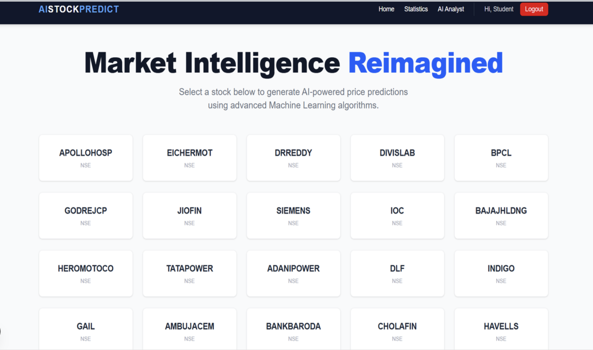

# AI Stock Analyst  
## Multi-Model Stock Price Prediction & Analytics Platform  

AI Stock Analyst is a multi-model financial forecasting platform designed to analyze historical market data, identify trend patterns, and generate short-term predictive insights using statistical and deep learning approaches.

The system integrates structured data processing, comparative model evaluation, and an interactive analytical interface to support informed financial analysis.

---

## Project Overview

This platform combines multiple machine learning paradigms to capture linear trends, non-linear relationships, and temporal dependencies in stock price movements.  

It emphasizes:
- Reliable financial data sourcing
- Structured preprocessing pipelines
- Comparative model performance evaluation
- Stable and interpretable prediction outputs

---

## Machine Learning Framework

The forecasting engine incorporates multiple regression and deep learning models to evaluate predictive consistency across different learning paradigms:

### Linear Regression
Used as a statistical baseline model to capture linear relationships between engineered features and stock price movements.

### Random Forest Regressor
An ensemble-based model leveraging multiple decision trees to reduce variance and capture non-linear dependencies in market data.

### XGBoost Regressor
Gradient boosting framework optimized for structured data, enabling improved generalization and performance under volatile market conditions.

### LSTM (Long Short-Term Memory Network)
A recurrent neural network architecture designed to model sequential dependencies and temporal dynamics in time-series stock data.

Each model was trained and evaluated under consistent preprocessing conditions to ensure fair comparison and performance reliability.

---

## Data Pipeline & Processing

- Historical market data sourced from Yahoo Finance (yFinance API) and Kaggle datasets  
- Structured data validation and consistency checks  
- Handling of missing values and normalization  
- Feature engineering for trend representation  
- Time-series structured data preparation for LSTM modeling  

The focus was placed on maintaining data reliability, stability, and reproducibility across experiments.

---

## Model Evaluation Metrics

Model performance was assessed using:

- R² Score  
- Root Mean Squared Error (RMSE)  
- Mean Absolute Error (MAE)  

Top-performing configurations achieved approximately 91% R² score in short-term trend forecasting scenarios.

---

## Analytical Interface

The platform includes an interactive analytics interface enabling:

- Real-time stock performance tracking  
- Visual comparison of model predictions  
- Trend pattern visualization  
- Structured exploration of predictive outputs  
- Financial query interaction through an integrated assistant  

---

## Screenshots

### Dashboard

---

### Data Visualisation

---

### Sample Predictions

---

### Key Algorithms in Use  

---

### Key Algorithms in Use  

---

### Chatbot Features

---

## Tech Stack

### Machine Learning
Python, Scikit-learn, XGBoost, TensorFlow / Keras (LSTM)

### Data Analytics
NumPy, Pandas, Matplotlib, Seaborn

### Development Tools
Jupyter Notebook, Google Colab, Git, GitHub

### Data Sources
Yahoo Finance (yFinance API), Kaggle

---

## Presentation

Project presentation and detailed explanation:

[Project Presentation (PDF)](https://drive.google.com/file/d/11iVHtXpnkF8pYod2K_oNFkv1CPFYWAiH/view?usp=sharing)

---

## Future Enhancements

- Integration of technical indicators (RSI, MACD, Bollinger Bands)  
- Model ensembling for improved robustness  
- Extended forecasting horizons  
- Pipeline optimization for scalable experimentation  

---

## Contribution

Contributions, suggestions, and improvements are welcome.
